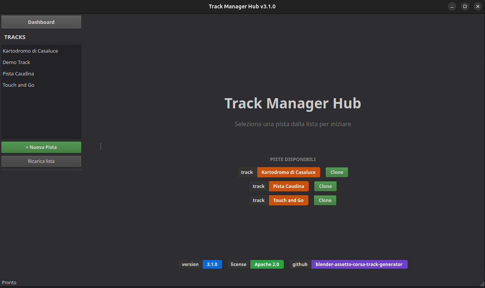
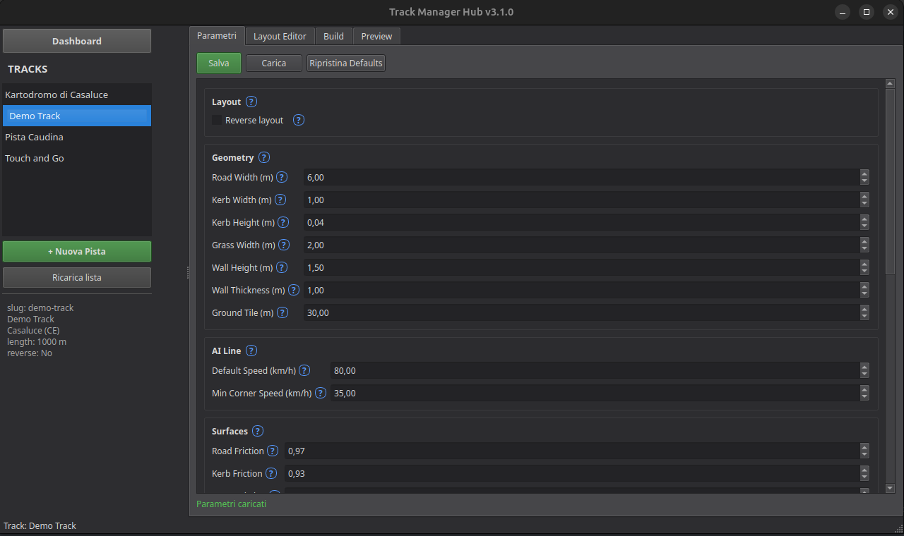
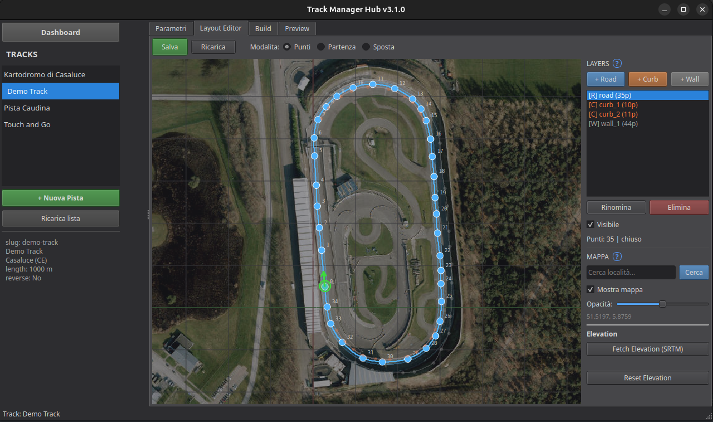
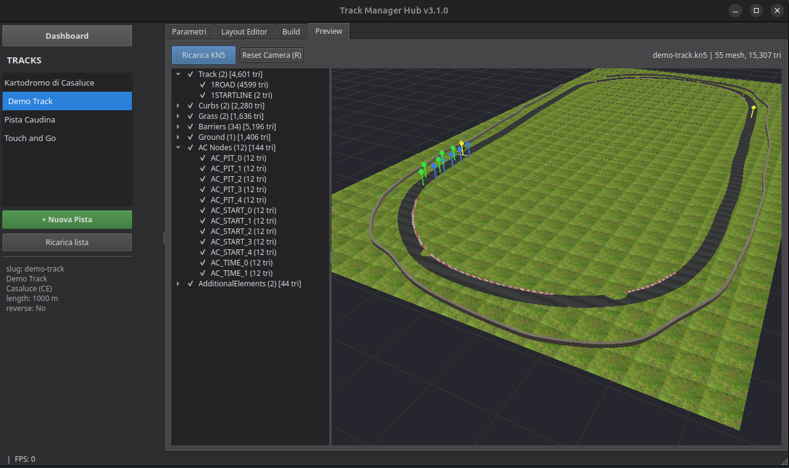
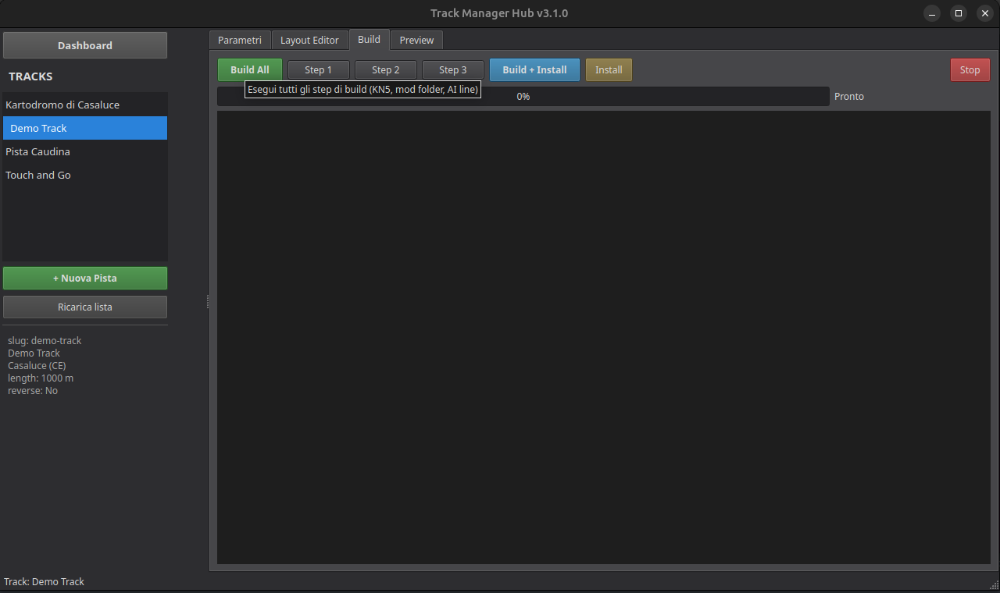

# Blender Assetto Corsa Track Generator

[](https://github.com/KinG-InFeT/blender-assetto-corsa-track-generator)


[](https://github.com/KinG-InFeT/blender-assetto-corsa-track-generator/blob/main/LICENSE)
[](https://github.com/KinG-InFeT/blender-assetto-corsa-track-generator)
[](https://assetto-corsa-mods.luongovincenzo.it/generatore-tracciati-assetto-corsa)

Pipeline centralizzata per generare, buildare e installare mod pista per Assetto Corsa da file Blender.
I progetti pista sono repo data-only; tutta la logica vive qui.

Cross-platform: Linux e Windows.

## Requisiti

- Python 3.10+
- Blender 5.0+
- Assetto Corsa (Steam)

## Setup

```bash
# Venv nel progetto pista (non qui)
cd ../casaluce-track
python3 -m venv .venv
source .venv/bin/activate        # Linux
# .venv\Scripts\activate         # Windows
pip install -r ../blender-assetto-corsa-track-generator/requirements.txt
```

## Comandi CLI

```bash
# Linux
TRACK_ROOT=/path/to/track python3 build_cli.py              # Build
TRACK_ROOT=/path/to/track python3 build_cli.py --install     # Build + install
TRACK_ROOT=/path/to/track python3 install.py                 # Solo install
source ../casaluce-track/.venv/bin/activate && python3 manager.py  # GUI Manager

# Windows (cmd)
set TRACK_ROOT=C:\path\to\track&& python build_cli.py              # Build
set TRACK_ROOT=C:\path\to\track&& python build_cli.py --install     # Build + install
set TRACK_ROOT=C:\path\to\track&& python install.py                 # Solo install
..\casaluce-track\.venv\Scripts\activate && python manager.py       # GUI Manager
```

## Variabili d'ambiente

| Variabile | Descrizione | Default |
|-----------|-------------|---------|
| `TRACK_ROOT` | Path al progetto pista | Obbligatorio |
| `TRACK_REVERSE` | `1` per layout reverse | `0` |
| `AC_DIR` | Path Assetto Corsa custom | Auto-detect |

---

## GUI Manager

Il Manager e' l'interfaccia principale per gestire tutte le piste. Si avvia con `python3 manager.py` e scopre automaticamente tutti i progetti pista presenti nella cartella parent del generatore (cerca sottocartelle con `track_config.json`).

Ogni bottone, campo e controllo ha un **tooltip in italiano** visibile al passaggio del mouse. I messaggi di stato (salvataggio, caricamento, errori) scompaiono automaticamente dopo 4 secondi.

Finestra: 1280x720 (HD 720p), centrata sullo schermo primario.

### Dashboard

All'avvio il Manager mostra la dashboard con il nome del progetto, i badge (versione, licenza, GitHub) e la lista delle piste disponibili con i bottoni **Clone** per scaricare i repository.



### Sidebar sinistra

- **Dashboard**: torna alla schermata iniziale
- **Lista piste**: tutte le piste trovate, ordinate alfabeticamente. Click per selezionare
- **+ Nuova Pista**: crea un nuovo progetto pista (vedi sezione dedicata)
- **Ricarica lista**: aggiorna la lista dopo clonazione o creazione
- **Info**: mostra slug, nome, localita, lunghezza e se ha il layout reverse

### Tab Parametri



Modifica tutti i parametri salvati in `track_config.json`. Tre bottoni in alto:

- **Salva**: scrive le modifiche su disco
- **Carica**: rilegge dal file (annulla le modifiche non salvate)
- **Ripristina Defaults**: resetta tutti i valori a quelli di `defaults.json`

#### Layout

| Campo | Descrizione |
|-------|-------------|
| **Reverse layout** | Checkbox. Se attivo, la build genera anche il layout in senso opposto (CCW). Raddoppia gli step di build da 3 a 6 |

#### Geometria

Tutti i parametri geometrici che controllano la generazione 3D della pista in Blender.

| Campo | Range | Default | Descrizione |
|-------|-------|---------|-------------|
| **Road Width** | 3.0 - 20.0 m | 6.0 | Larghezza della strada asfaltata |
| **Kerb Width** | 0.2 - 3.0 m | 1.0 | Larghezza dei cordoli ai lati della strada |
| **Kerb Height** | 0.01 - 0.3 m | 0.08 | Altezza dei cordoli. Profilo trapezoidale con smussatura 20% per lato |
| **Grass Width** | 1.0 - 50.0 m | 2.0 | Larghezza della fascia d'erba tra cordolo e muro |
| **Wall Height** | 0.5 - 5.0 m | 1.5 | Altezza delle barriere perimetrali. Costruite con bmesh (3 facce per sezione: outer, inner, top). Base Z interpolata bilinearmente dalla griglia del terreno per combaciare con la superficie renderizzata |
| **Wall Thickness** | 0.3 - 3.0 m | 1.0 | Spessore delle barriere. Segmentate ogni ~25 m per la collision di AC |
| **Ground Tile** | 5.0 - 100.0 m | 30.0 | Dimensione del tile del terreno sotto la pista |

#### AI Line

Parametri che controllano la linea di guida dell'AI (fast_lane.ai).

| Campo | Range | Default | Descrizione |
|-------|-------|---------|-------------|
| **Default Speed** | 20 - 200 km/h | 80.0 | Velocita massima dell'AI sui rettilinei |
| **Min Corner Speed** | 10 - 100 km/h | 35.0 | Velocita minima nelle curve piu strette. L'AI interpola tra le due velocita in base alla curvatura |

#### Superfici

Coefficienti di attrito per le diverse superfici. Determinano il grip delle auto in gioco.

| Campo | Range | Default | Descrizione |
|-------|-------|---------|-------------|
| **Road Friction** | 0.50 - 1.00 | 0.97 | Attrito asfalto. 1.0 = grip massimo |
| **Kerb Friction** | 0.50 - 1.00 | 0.93 | Attrito cordoli. Leggermente piu basso dell'asfalto per simulare la perdita di aderenza |
| **Grass Friction** | 0.10 - 1.00 | 0.60 | Attrito erba. Molto basso per penalizzare le uscite di pista |

> **Nota**: le barriere (WALL) non hanno una voce in `surfaces.ini`. AC tratta le mesh senza corrispondenza come barriere solide di default. Definire `KEY=WALL` farebbe trattare i muri come superfici guidabili invece che come barriere fisiche.

#### Elevation

| Campo | Range | Default | Descrizione |
|-------|-------|---------|-------------|
| **Scale** | 0.0 - 5.0 | 1.0 | Moltiplicatore elevazione SRTM. 0=piatto, 1=reale, >1=esagerato |

#### Banking

| Campo | Range | Default | Descrizione |
|-------|-------|---------|-------------|
| **Enable banking** | on/off | on | Attiva/disattiva la superelevazione in curva |
| **Design Speed** | 20 - 200 km/h | 60.0 | Velocita di progetto per il calcolo dell'inclinazione |
| **Friction** | 0.1 - 1.0 | 0.7 | Coefficiente di attrito laterale |
| **Scale** | 0.0 - 3.0 | 1.0 | Moltiplicatore banking. 0=nessuna inclinazione, 1=fisicamente corretto |
| **Max Angle** | 1 - 45° | 15.0 | Angolo massimo di banking |

#### Info

Metadati della pista mostrati in Assetto Corsa e Content Manager.

| Campo | Tipo | Descrizione |
|-------|------|-------------|
| **Name** | Testo | Nome visualizzato nel menu di AC (es. "Kartodromo di Casaluce") |
| **City** | Testo | Citta dove si trova il circuito |
| **Province** | Testo | Sigla provincia (es. CE, BN, TA) |
| **Region** | Testo | Regione (es. Campania, Puglia) |
| **Country** | Testo | Nazione (es. Italy) |
| **Length (m)** | Testo | Lunghezza del tracciato in metri. Usato per il calcolo della scala della centerline |
| **Pitboxes** | Testo | Numero di pit box. Determina quanti AC_PIT_N e AC_START_N empties vengono generati |
| **Direction** | Menu | `clockwise` o `counter-clockwise`. Senso di marcia del layout default |
| **Geotags** | Testo | Coordinate GPS separate da virgola (lat, lon). Mostrate in Content Manager |

### Tab Layout Editor



Editor 2D per disegnare la pianta del circuito. Tutti gli elementi della pista (strada, cordoli, muri) sono layer separati modificabili individualmente. Una mappa satellitare interattiva fa da sfondo per il tracciamento. Il risultato viene salvato in `centerline.json`.

#### Toolbar

- **Salva**: salva tutti i layer, posizione start e riferimento mappa in `centerline.json`
- **Ricarica**: rilegge il file annullando le modifiche
- **Modalita Punti**: (default) aggiunge, sposta ed elimina punti di controllo sul layer attivo
- **Modalita Partenza**: posiziona il punto di partenza e la direzione della pista
- **Modalita Sposta**: sposta e ruota l'intera pista sulla mappa

#### Canvas - Interazione mouse

**In modalita Punti:**

| Azione | Effetto |
|--------|---------|
| Click sinistro su vuoto | Aggiunge un nuovo punto al layer attivo |
| Click sinistro su punto + drag | Sposta il punto |
| Click destro su punto | Elimina il punto |
| Rotella | Zoom in/out |
| Click centrale / Shift+click sinistro | Pan (scorrimento) |

**In modalita Partenza:**

| Azione | Effetto |
|--------|---------|
| Click sinistro | Piazza il marcatore di partenza (cerchio verde) |
| Click destro + drag | Ruota la freccia di direzione della pista |

**In modalita Sposta:**

| Azione | Effetto |
|--------|---------|
| Click sinistro + drag | Sposta tutti i layer e il marker start |
| Click destro + drag | Ruota tutti i layer attorno al centroide |

Pan e zoom funzionano sempre, in tutte le modalita.

#### Sidebar - Layer

Ogni pista puo avere piu layer sovrapposti. Il layer attivo (selezionato nella lista) e' quello su cui si aggiungono/spostano i punti.

**Tipi di layer:**

| Tipo | Colore | Chiuso | Max | Descrizione |
|------|--------|--------|-----|-------------|
| **Road** | Blu | Si | 1 | Centerline della strada. Poligono chiuso che definisce il percorso. Obbligatorio. Mostra la striscia stradale semi-trasparente con i bordi visibili |
| **Curb** | Arancione | Si/No | Illimitati | Percorso dei cordoli. Snap automatico al bordo strada: i punti si agganciano al bordo sinistro/destro della road. Preview ghost (cerchio arancione) durante l'hover |
| **Wall** | Grigio | Si/No | Illimitati | Percorso delle barriere perimetrali. Segmentate automaticamente nella build. Base Z interpolata dalla griglia del terreno |

- **[+ Road] / [+ Curb] / [+ Wall]**: aggiunge un nuovo layer (nome auto-incrementale)
- **Rinomina**: cambia il nome del layer selezionato
- **Elimina**: rimuove il layer (con conferma)
- **Visibile**: checkbox per mostrare/nascondere il layer nel canvas
- **Info**: numero punti e tipo (chiuso/aperto)

I layer non attivi sono disegnati in trasparenza. Solo il layer attivo mostra i punti di controllo numerati e modificabili.

#### Striscia stradale e snap cordoli

Il layer **road** visualizza una striscia semi-trasparente che mostra la larghezza effettiva della pista (da `road_width` in Parametri). I bordi sinistro e destro sono disegnati con linee colorate.

I layer **curb** hanno snap automatico ai bordi della road:
- **Click**: il nuovo punto si aggancia al bordo strada piu vicino
- **Drag**: il punto segue il bordo durante lo spostamento
- **Hover**: un cerchietto ghost arancione mostra dove verra piazzato il punto
- **Re-snap automatico**: spostando un punto della road, tutti i punti curb si riagganciano ai nuovi bordi
- **Cambio road_width**: i punti curb si adattano alla nuova larghezza

Lo snap non si applica ai layer **wall** (posizionamento libero). Se non esiste un layer road con almeno 3 punti, lo snap e' disattivato e i curb si posizionano liberamente.

#### Sidebar - Mappa

Mappa satellitare (Esri World Imagery) come riferimento per disegnare il tracciato. I tile vengono scaricati via HTTP e cachati su disco (Linux: `~/.cache/ac-track-manager/tiles/`, Windows: `%LOCALAPPDATA%/ac-track-manager/tiles/`). Il livello di zoom si adatta automaticamente al livello di zoom del canvas. La mappa segue pan e zoom, ricaricando i tile per l'area visibile.

- **Cerca**: inserisci il nome del luogo e premi Invio o il bottone Cerca. Suggerimenti automatici dopo 3 caratteri (geocoding Nominatim via geopy)
- **Mostra mappa**: checkbox per mostrare/nascondere la mappa
- **Opacita**: slider per regolare la trasparenza della mappa (20%-80%)
- **Coordinate**: mostra le coordinate GPS del centro mappa

Quando si cerca una localita, le coordinate vengono automaticamente copiate nel campo Geotags del tab Parametri. Se nessun centro mappa e' impostato, viene usato Napoli come default.

#### Sidebar - Elevation

- **Fetch Elevation (SRTM)**: scarica i dati di elevazione satellitare per tutti i punti di controllo di tutti i layer. I dati vengono smoothati con CubicSpline e salvati in `centerline.json` come array `elevation` per ogni layer
- **Stats**: mostra min/max/delta elevazione per il layer road

I dati di elevazione vengono invalidati automaticamente quando i punti di controllo vengono modificati (aggiunti, rimossi, spostati). In tal caso occorre re-fetchare.

#### Formato centerline.json

```json
{
  "version": 2,
  "layers": [
    {"name": "road", "type": "road", "closed": true, "points": [[x,y], ...], "elevation": [z0, z1, ...]},
    {"name": "curb_left", "type": "curb", "closed": true, "points": [...], "elevation": [...]},
    {"name": "wall_left", "type": "wall", "closed": true, "points": [...], "elevation": [...]}
  ],
  "start": {"position": [x, y], "direction": 90.0},
  "map_center": [41.0072, 14.1892]
}
```

L'array `elevation` e' opzionale per ogni layer. Se assente, l'elevazione e' 0 (piatto, backward-compatible con v3.0.0).

### Tab Preview



Anteprima 3D del modello KN5 generato dalla build. Mostra la pista completa con texture, marcatori AC e frecce di direzione.

#### Controlli

- **Ricarica KN5**: ricarica il modello dal file
- **Reset Camera (R)**: vista ortogonale dall'alto
- **Mouse sinistro + drag**: ruota la camera (orbita)
- **Rotella**: zoom in/out (limiti proporzionali alla scena, near/far plane dinamico)
- **Click centrale + drag**: pan lungo il piano di vista (tiene conto del pitch della camera)

#### Mesh Tree

Pannello a sinistra con la lista gerarchica delle mesh, organizzata per collezione:

| Collezione | Contenuto |
|------------|-----------|
| **Track** | Strada e linea di partenza |
| **Curbs** | Cordoli sinistro e destro |
| **Grass** | Fasce d'erba laterali |
| **Barriers** | Muri perimetrali (segmentati, bmesh) |
| **Ground** | Terreno sottostante |
| **AC Nodes** | Empties AC (start, pit, time) |
| **Other** | Mesh non classificate |

Ogni collezione e ogni singola mesh hanno una checkbox per mostrare/nascondere. Il toggle su una collezione attiva/disattiva tutte le mesh al suo interno.

#### Marcatori visuali

- **AC_START** (verde): posizioni di partenza delle auto in griglia
- **AC_PIT** (blu): posizioni dei pit box
- **AC_TIME** (giallo): gate cronometrici (start/finish e intermedi)
- **Frecce direzione** (arancione): frecce lungo la centerline che indicano il senso di marcia

Se non e' presente un file KN5, il tab mostra un placeholder con istruzioni per eseguire la build.

### Protezione .blend modificati

Dopo ogni generazione, `init_blend.py` scrive un file `<slug>.blend.meta` contenente lo SHA256 del `.blend`. Al build successivo, se `centerline.json` e' piu recente del `.blend` (e quindi il sistema vorrebbe rigenerare), viene confrontato l'hash attuale con quello salvato:

- **Hash uguale** o **meta mancante** (primo build dopo l'introduzione della feature): la rigenerazione procede silenziosamente. Se il meta non esisteva viene creato come baseline.
- **Hash diverso** (modificato in Blender): viene mostrato un avviso con tre opzioni:
  - **Rigenera (con backup)**: crea una copia `<slug>_YYYYMMDD_HHMMSS.blend.bak` e rigenera.
  - **Usa .blend attuale**: salta la rigenerazione e builda direttamente dal `.blend` modificato.
  - **Annulla**: interrompe la build.

#### CLI

```bash
# Linux
TRACK_ROOT=/path/to/track python3 build_cli.py               # Prompt interattivo se .blend modificato
TRACK_ROOT=/path/to/track python3 build_cli.py --force-init   # Backup automatico, senza prompt

# Windows (cmd)
set TRACK_ROOT=C:\path\to\track&& python build_cli.py
set TRACK_ROOT=C:\path\to\track&& python build_cli.py --force-init
```

#### GUI Manager

I bottoni **Build All** e **Build + Install** mostrano automaticamente un dialogo `QMessageBox` quando il `.blend` risulta modificato. I bottoni **Step N** e **Install** non richiedono protezione.

### Tab Build



Esegue la pipeline di generazione e installazione della mod.

#### Bottoni principali

| Bottone | Azione |
|---------|--------|
| **Build All** | Esegue tutti gli step in sequenza |
| **Build + Install** | Build completa + installazione in Assetto Corsa |
| **Install** | Solo installazione (senza rigenerare) |
| **Step N** | Esegue un singolo step (per debug) |
| **Stop** | Interrompe il processo corrente |

#### Pipeline

**Senza reverse (3 step):**

| Step | Descrizione |
|------|-------------|
| 1. Export KN5 | Blender esporta la scena .blend in formato KN5 (modello 3D + texture embedded) |
| 2. Mod folder | Crea la struttura cartelle AC: surfaces.ini, cameras.ini, map.ini, lighting.ini, groove.ini, ui_track.json |
| 3. AI line | Genera fast_lane.ai dalla centerline (interpolazione Catmull-Rom + resample a 2m) |

**Con reverse (6 step):**

| Step | Descrizione |
|------|-------------|
| 1. Export KN5 | Export layout default |
| 2. Mod folder | Crea struttura con sotto-layout default/ e reverse/ |
| 3. AI line CW | AI per il senso orario |
| 4. Reverse blend | Crea copia del .blend con empties AC ribaltati per il senso opposto |
| 5. KN5 reverse | Export del layout reverse |
| 6. AI line CCW | AI per il senso antiorario |

Se il file .blend non esiste, viene aggiunto automaticamente uno step 0 "Init Blend" che genera il modello 3D da `centerline.json` usando GeoNodes (RoadGen, CurbGen, GrassGen) e bmesh diretto per i muri.

#### Log

Terminale con output in tempo reale. Colori: bianco (normale), giallo (warning), blu (inizio step), verde (successo), rosso (errore).

Al completamento: copia i .kn5 nella cartella mod e crea lo zip distribuibile in `builds/`.

#### Installazione

L'installer (`install.py`) gestisce:

- Copia della mod in `content/tracks/<slug>/`
- Download e setup di Content Manager (launcher alternativo, impostato come launcher Steam su Linux)
- Download e installazione di Custom Shaders Patch (CSP)
- Installazione font di sistema (solo Linux)
- Pulizia cache AC e Content Manager

---

## Creare una nuova pista

1. Avvia il Manager con `python3 manager.py`
2. Click **Nuova Pista** nella sidebar
3. Compila:
   - **Directory padre**: dove creare la cartella (default: parent del generatore)
   - **Slug**: nome univoco della cartella e identificativo della pista (es. `mia_pista`). Usato anche come nome dei file .blend e .kn5
   - **Nome**: nome visualizzato in AC (opzionale, default = slug)
4. Click OK. Il Manager crea automaticamente:
   - Cartella progetto con `track_config.json`, `centerline.json`, `.gitignore`
   - Texture di base nella cartella `textures/` (asphalt, curb, grass, barrier, startline, sponsor)
   - Ambiente virtuale `.venv/` con tutte le dipendenze installate
5. Il Manager passa al tab **Layout Editor**: cerca la localita nella barra di ricerca per caricare la mappa satellitare
6. Disegna la strada aggiungendo punti con click sinistro sopra la mappa
7. Aggiungi layer cordoli e muri dal pannello laterale
8. Usa la modalita **Sposta** per allineare la pista alla mappa (trascina per spostare, click destro per ruotare)
9. **Salva** il layout
10. Vai al tab **Parametri** per configurare larghezze, attriti, info e metadati
11. Vai al tab **Build** e click **Build All** (oppure **Build + Install** per installare direttamente)

## Modificare una pista esistente

1. Seleziona la pista dalla sidebar
2. Modifica i parametri nel tab **Parametri** e salva
3. Modifica il layout nel tab **Layout Editor** (sposta punti, aggiungi/rimuovi layer) e salva
4. Tab **Build** -> **Build All** per rigenerare, oppure **Build + Install** per installare subito
5. Tab **Preview** per verificare il risultato 3D prima di installare

---

## Struttura file

```
build_cli.py                  Build pipeline CLI
install.py                    Installer cross-platform
manager.py                    GUI PyQt5
defaults.json                 Valori default per tutte le piste
requirements.txt              Dipendenze Python (numpy, Pillow, PyQt5, PyOpenGL, geopy, srtm.py, scipy)
scripts/
  blend_meta.py               SHA256 fingerprint per protezione .blend modificati
  init_blend.py               Genera .blend da centerline.json (GeoNodes)
  spline_utils.py             Catmull-Rom splines, I/O centerline, resample
  export_kn5.py               Export scena Blender in formato KN5
  setup_mod_folder.py         Crea struttura mod e file config AC
  generate_ai_line.py         Genera AI driving line (fast_lane.ai)
  create_reverse_blend.py     Crea .blend reverse (flip AC_ empties)
  extract_centerline.py       Estrae centerline da layout.svg
  platform_utils.py           Utility cross-platform
textures/                     Texture di base copiate nei nuovi progetti
  asphalt.png, curb_rw.png, grass.png, barrier.png, startline.png, sponsor1.png
tools/
  track_viewer.py             Preview 3D KN5 (usato dal Manager)
demo/
  RoadGen.blend               Template GeoNodes (RoadGen, CurbGen, GrassGen)
```

## Progetto pista (struttura richiesta)

```
<slug>.blend            Sorgente Blender (generato da init_blend.py, modificabile)
centerline.json         Dati layout v2 (layers road/curb/wall, start, map_center)
track_config.json       Configurazione (slug, layouts, geometry, surfaces, ai_line, elevation, banking, info)
textures/               Texture PNG (asphalt, grass, curb_rw, barrier, startline, sponsor1)
cover.png               Copertina mod (generata automaticamente, personalizzabile)
```

Valori non specificati in `track_config.json` usano quelli di `defaults.json`.

## Piste

| Pista | Slug | Reverse | Localita | Web |
|-------|------|---------|----------|-----|
| Kartodromo di Casaluce | `casaluce` | Si | Casaluce (CE) | [Link](https://assetto-corsa-mods.luongovincenzo.it/casaluce) |
| Pista Caudina | `pista_caudina` | No | Montesarchio (BN) | [Link](https://assetto-corsa-mods.luongovincenzo.it/montesarchio) |
| Touch and Go | `touch_and_go` | Si | Martina Franca (TA) | [Link](https://assetto-corsa-mods.luongovincenzo.it/martina-franca) |
